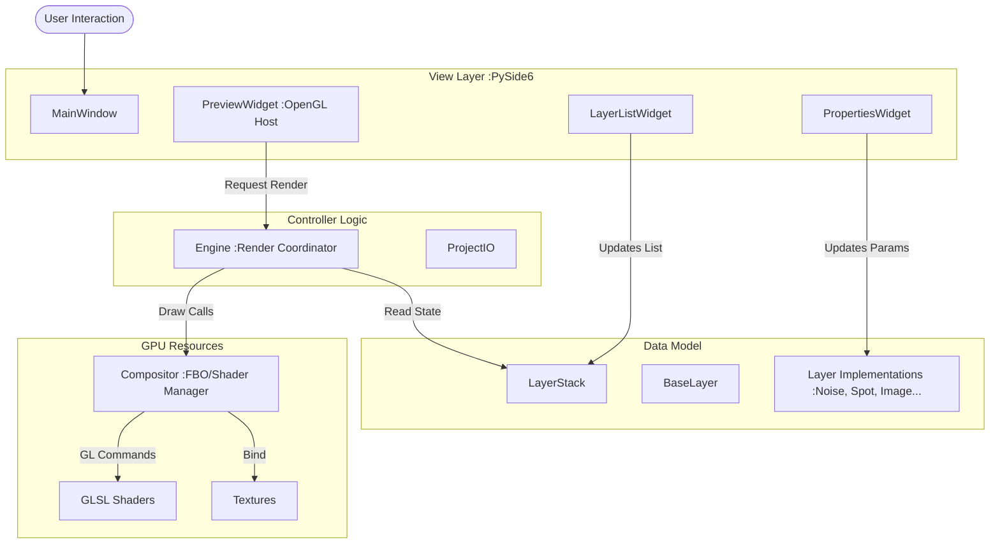

# 02. アーキテクチャ設計

本アプリケーションは、**Model-View-Controller (MVC)** パターンに影響を受けた、明確なレイヤー構造を持っています。

## システムアーキテクチャ図

## 各コンポーネントの詳細責務

### 1. View Layer (UI)
ユーザーインターフェースを担当します。描画ロジックの詳細は知らず、データの変更と再描画リクエストのみを行います。
-   **PreviewWidget (`src/ui/preview_widget.py`)**: 
    -   `Engine` のインスタンスを保持し、Qtの `paintEvent` に合わせてレンダリングをキックします。
-   **PropertiesWidget (`src/ui/properties.py`)**:
    -   選択されたレイヤーのプロパティを動的に解析し、適切なUI部品（スライダー、カラーピッカー等）を生成します。

### 2. Data Model (Core)
アプリケーションの状態を保持します。純粋なPythonオブジェクトであり、PySideやOpenGLへの直接的な依存を極力排除しています（シリアライズ容易性のため）。
-   **LayerStack (`src/core/layer_stack.py`)**:
    -   レイヤーの順序リストを管理します。リスト操作（追加、削除、移動）のAPIを提供します。
-   **Layer (`src/layers/`)**:
    -   各レイヤーの基底クラス `BaseLayer` と、具象クラス（`NoiseLayer` 等）で構成されます。
    -   それぞれのレイヤーは、自分自身を描画するためのシェーダーパスと、パラメータ（Uniforms）定義を持っています。

### 3. Render Engine (Logic)
UIとGPUの橋渡しを行います。
-   **Compositor (`src/core/compositor.py`)**:
    -   FBOの生成・破棄、テクスチャユニットの管理、ビューポート設定など、OpenGLのステートマシンを管理します。
    -   **Ping-Pong Rendering** のアルゴリズムはここに実装されています。

## 設計のポイント: 疎結合

このアーキテクチャの最大の利点は **「各層の独立性」** です。
例えば、将来的にGUIフレームワークをWebベース（Electron等）に置き換えることになったとしても、`Model` と `GPU (Logic)` のロジックの多くは再利用可能です（Pythonバックエンドとして動作させる場合）。
また、新しい種類のレイヤーを追加する場合も、`src/layers/` にクラスファイルを追加し、シェーダーを書くだけで済み、エンジン本体に手を入れる必要はありません。
